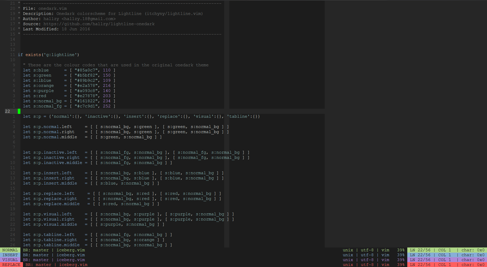

# lightline-iceberg

Below is a picture of the iceberg colorscheme in vim along with how lightline
looks with four different vim modes.

I am open to suggestions, and improvements, so if you like a different colour
combination then by all means, let me know, or create a pull request.



This is an [itchyny](https://github.com/itchyny) / [lightline.vim](https://github.com/itchyny/lightline.vim)
theme for [cocopon](https://github.com/cocopon) / [iceberg.vim](https://github.com/cocopon/iceberg.vim).

I used the same colour codes used in the original iceberg theme, so the colours
should match.

### Installation

Use your favourite plugin manager or just add the `autoload/` folder and all
subdirectories to `.vim/`

Then add this theme to the lightline configuration in your .vimrc using the name
`"iceberg"`. For more information on this see the lightline repo.

As a summary you can set the colourscheme using something like this:

```viml
let g:lightline.colorscheme="iceberg"
```

or if you have other lightline configurations already, you can just add it to
those using something similar to the below.

```viml
let g:lightline = {
  \ 'colorscheme': 'iceberg',
  \
}
```

For more examples see the original lightline repo and just search for
`colorscheme` in the README.
